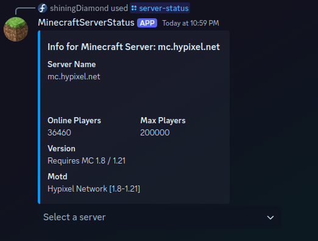

# Discord-ServerStatus

[](https://hub.docker.com/r/diamondcoder295/discord-minecraft-bot)

A bot that gives game server status info via command, primary focus is minecraft servers for now.
Commands are stored on a per-guild basis. This may change in the future.


## Commands
 - add-server: adds a new server
 - default-server: sets an existing server as the default
 - server-status: gets the status for a server
 - delete-server: removes a server for a guild

## Preparing Docker container
You need to specify the `CLIENT_ID` and `DISCORD_TOKEN` environment variables. You also need to 
mount a volume with a `database.sqlite` file inside it to `/app/storage` inside the container.
There is an empty template database inside src/storage you can copy.

Example docker-compose.yml:
```yaml
version: '3'
services:
  discord-minecraft-bot:
    image: diamondcoder295/discord-minecraft-bot:latest
    volumes:
      - /home/Diamond/Docker/Discord-Minecraft/data/storage:/app/storage
    environment:
      - CLIENT_ID=CLIENT_ID_HERE
      - DISCORD_TOKEN=TOKEN_HERE
```

## Running Locally
You can also run without containerization. Just clone the repo then copy `src/storage/database-template.sqlite`
to `storage/database.sqlite` then you can set your environment variables as described in the docker section and then run `npm run start`

## Future features
Im looking to integrate Terraria and maybe other game servers, the code is already ready to accept
new server types, I just need to find an appropriate api to get information.